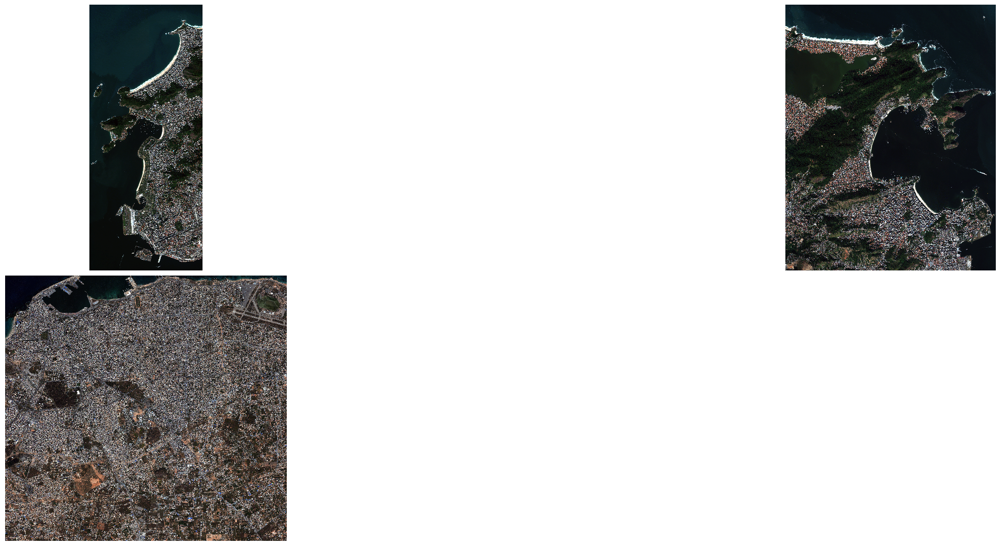
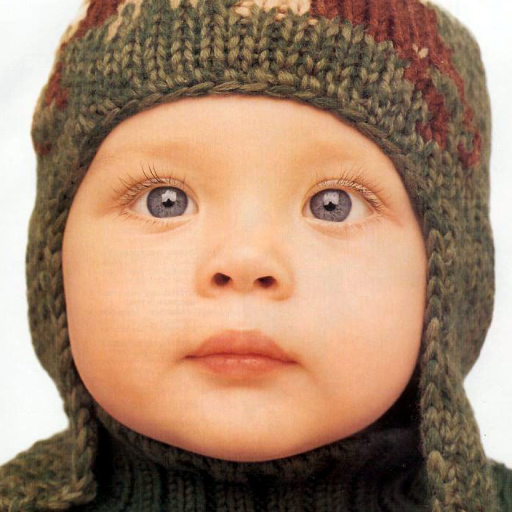
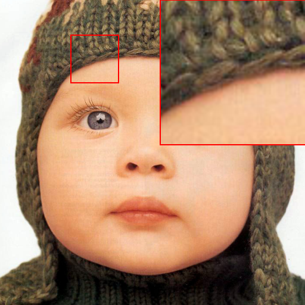

# PSData
A Large-Scale General Pan-sharpening DataSet, which contains PSData3 (QB, GF-2, WV-3) and PSData4 (QB, GF-1, GF-2, WV-2).

## Examples of PSData3 With RGB

### QB

* [Simulated Data 1st](examples/PSData3/QB.png) 

  
  
### GF-2
* [Simulated Data 1st](examples/PSData3/GF-2.png) 

  
### WV-3
* [Simulated Data 1st](examples/PSData3/WV-3.png) 

  

## Examples of PSData4 With RGB

### QB
* [Simulated Data 1st](examples/PSData4/QB.png) 

  
### GF-1
* [Simulated Data 1st](examples/PSData4/GF-1.png) 

  
### GF-2
* [Simulated Data 1st](examples/PSData4/GF-2.png) 

  
### WV-2
* [Simulated Data 1st](examples/PSData4/WV-2.png) 

  
## Process
We use MATLAB and ENVI5.3 to handle raw data. If you want to get the raw data, please turn to the references. Also we provide some tools (eg. remove the border, cut into the patch, make data, split data) to make the training data and the test data. Later we will update the tools about zoom details, plot and save figures. See tools/tools.py for details.

### Remove the border
Border Message has been shown in border.txt and config/border.py.

### Cut into the Patch
We usually cut the raw data into the 64 x 64 pixels or 256 x 256 pixels. You can set the patch_size = 64/256/....

### Make data

#### Supervised
We follow the Wald's protocol to downsample the MS and the PAN images (downsamping factor is 4x). Please set the supervised = True.

#### Unsupervised
You can use the data directly. Please set the supervised = False.

### Split data
We split the data into training dataset and test dataset. We provide two strategies.
First, you can use the id of 0 - (n-1) to train and use the id of n to test.
Second, you can shuffle all data and randomly choose 90% to train and 10% to test.

## Zoom For Details
You need to change the file path in local_show/local_show.m. And the file that ends with _local_show is the generated image. 
* [Original](local_show/baby_GT.bmp) 


  
* [Zoomed](local_show/baby_GT_local_show.bmp) 

 

## Citation
If the project is helpful to you, please consider citing us.
```
@misc{YLZ2021,
  author = {Y L. Zhang, Y. Sun},
  title = {PSData},
  year = {2021},
  publisher = {GitHub},
  journal = {GitHub repository},
  howpublished = {\url{https://github.com/yisun98/PSData}},
}
```


## References

1. https://github.com/liuqingjie/PSGAN
2. https://github.com/zhysora/PGMAN
3. https://github.com/jiaming-wang/DPFN/
4. https://github.com/yisun98/pan-sharpening
